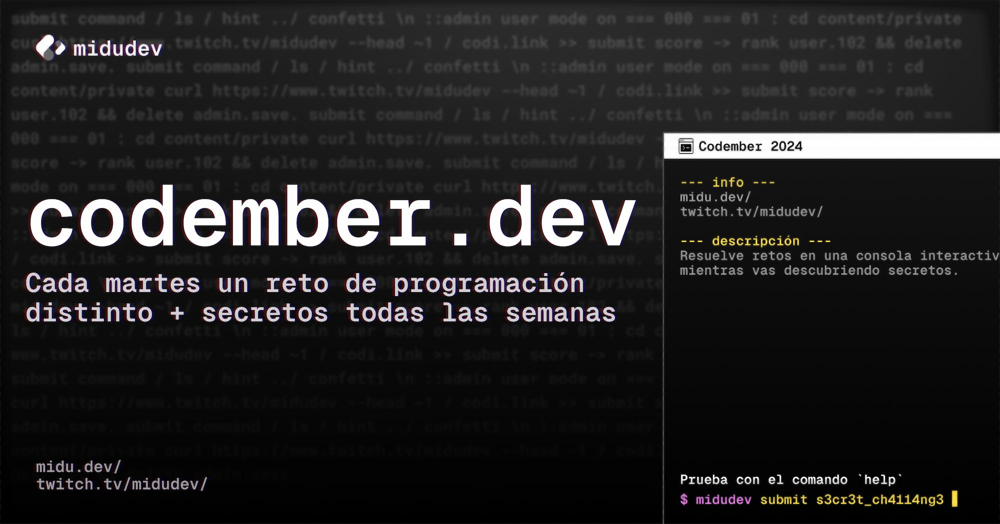

# 🚀 [Codember](https://codember.dev)
*Una iniciativa de [Midudev](https://midu.dev)*

**Explora los retos y las pistas, resuelve cada misterio y mejora tus habilidades de programación.** 

2024

## 🕹️ Retos:

1. 💻 **[Terminal desbloqueada](https://github.com/Cristian7B/Codember/blob/main/2024/RetoInicial.MD)**  
   _Desafío resuelto: Descubre cómo desbloquear la terminal._

2. 🎭 **[Estamos en peligro](https://github.com/Cristian7B/Codember/blob/main/2024/retoUno.py)**  
   _Un reto que pone en riesgo todo el sistema._

3. 😀 **[Siguiendo la pista](https://github.com/Cristian7B/Codember/blob/main/2024/retoDos.js)**  
   _Sigue las migajas de información para avanzar._

4. 🦖 **[Problemas en la red](https://github.com/Cristian7B/Codember/blob/main/2024/retoTres.py)**  
   _Resuelve el caos generado en el sistema._

5. 🤖 **[Terminator](https://github.com/Cristian7B/Codember/blob/main/2024/retoCuatro.js)**  
   _Ya está acorralada, finaliza con este reto._

## 🔥 Lista de Retos  
1. 🌌 **¡Multiverso a salvo!**  
2. 🔥 **¿Todo estará bien?**  
3. 🎮 **Konami code**  
4. 📷 **Observador Innato**  
5. 🎊 **Confetti lanzado**  
6. 👨‍💻 **Hacker eliminado**  
7. 💣 **Invocador del Caos**  
8. 🚨 **Error inesperado**  
9. 💻 **Admin ejemplar**  
10. 🏓 **Ping Pong**  
11. 🐈 **MiduGato**  
12. 🐈 **miau**  
13. 🪐 **mars.codes**  

🔍 Pistas por Reto

### 🌌 **¡Multiverso a salvo!**  
🔎 **Busca en las sombras:**  
> _La consola oculta la verdad. Ábrela y encuentra lo que necesitas._  

### 🔥 **¿Todo estará bien?**  
📂 **Desentierra los secretos:**  
> _Explora la carpeta `public` para hallar pistas entre los archivos._  

### 👽 **Contra**  
🎮 **Código legendario:**  
> _"¿Cuál es la combinación más famosa para activar trucos?"_  

### 📷 **Observador Innato**  
🖼️ **La verdad está en los detalles:**  
> _Revisa las imágenes en las metatags y observa lo que otros no ven._  

### 🎊 **Confetti lanzado**  
🎉 **Celebración discreta:**  
> _Hint #5: Cuando lo encuentres, entenderás el porqué del confetti._  

### 👨‍💻 **Hacker eliminado**  
💻 **Domina la consola:**  
> _Accede a la consola de administrador y experimenta con los comandos._  

### 💣 **Invocador del Caos**  
💀 **Explorador de textos ocultos:**  
> _"¿Conoces alguna bomba en ciberseguridad?"  
Lee el archivo `ghost.txt`, y no olvides **guardar utilizando `submit`**._  

### 🚨 **Error inesperado**  
🔐 **Codificación en acción:**  
> _Juega con los comandos `sec` y `chal`. Sigue las instrucciones, decodifica el mensaje y desbloquea el misterio._  

### 👨‍💻 **Admin ejemplar**  
⚙️ **ΩMEGA bloquea, tú desbloqueas:**  
> _Este comando está bloqueado. Encuentra la forma de habilitarlo e ingresa como administrador.  
⚠️ ¡Hazlo antes del secreto #10!_  

### 🏓 **Ping Pong**  
🏓 **Golpea y responde:**  
> _"Haz `****` en una web especial de **Midudev**."_  

### 🐈 **MiduGato**  
🐾 **Un gato curioso:**  
> _Usa el comando `version` y analiza el código fuente de la web. Los secretos te esperan._  

### 🐈 **miau**  
🔐 **Exploración privada:**  
> _Accede a la carpeta `private` habilitada. Examina los metadatos del contenido._  

### 🪐 **mars.codes**  
📧 **Correos desde Marte:**  
> _"Revisa el último comando `mail` y lee los mensajes. ¿Qué secretos estarán allí?"_  

